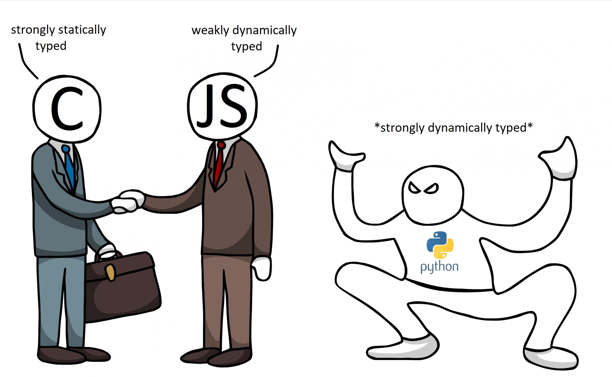

# 0x00. Python - Variable Annotations
| `Python` | `Back-end` |

## Concepts

For this project, we expect you to look at this concept:

- [`Advanced Python`](./Advanced_Python.md)



## Resources

**Read or watch:**
- [Python 3 typing documentation](https://intranet.alxswe.com/rltoken/5j0OtdWh36_HVAHKJX2gaA)
- [MyPy cheat sheet](https://intranet.alxswe.com/rltoken/Eud-nrUG7x3iT6JD2Sas-g)

## Learning Objectives

**General**

At the end of this project, you are expected to be able to explain to anyone, without the help of Google:

- Type annotations in Python 3
- How you can use type annotations to specify function signatures and variable types
- Duck typing
- How to validate your code with `mypy`

## Requirements

**General**

- Allowed editors: `vi`, `vim`, `emacs`
- All your files will be interpreted/compiled on Ubuntu 18.04 LTS using `python3` (version 3.7)
- All your files should end with a new line
- The first line of all your files should be exactly `#!/usr/bin/env python3`
- A `README.md` file, at the root of the folder of the project, is mandatory
- Your code should use the `pycodestyle` style (version 2.5.)
- All your files must be executable
- The length of your files will be tested using `wc`
- All your modules should have a documentation (`python3 -c 'print(__import__("my_module").__doc__)'`)
All your classes should have a documentation (python3 -c 'print(__import__("my_module").MyClass.__doc__)')
- All your functions (inside and outside a class) should have a documentation (`python3 -c 'print(__import__("my_module").my_function.__doc__)'` and `python3 -c 'print(__import__("my_module").MyClass.my_function.__doc__)'`)
- A documentation is not a simple word, it’s a real sentence explaining what’s the purpose of the module, class or method (the length of it will be verified)

## Tasks

### 0. Basic annotations - add

Write a type-annotated function `add` that takes a float `a` and a float `b` as arguments and returns their sum as a float.

```
bob@dylan:~$ cat 0-main.py
#!/usr/bin/env python3
add = __import__('0-add').add

print(add(1.11, 2.22) == 1.11 + 2.22)
print(add.__annotations__)

bob@dylan:~$ ./0-main.py
True
{'a':  <class 'float'>, 'b': <class 'float'>, 'return': <class 'float'>}
```

solution - [0-add.py](./0-add.py)

### 1. Basic annotations - concat

Write a type-annotated function `concat` that takes a string `str1` and a string `str2` as arguments and returns a concatenated string

```
bob@dylan:~$ cat 1-main.py
#!/usr/bin/env python3
concat = __import__('1-concat').concat

str1 = "egg"
str2 = "shell"

print(concat(str1, str2) == "{}{}".format(str1, str2))
print(concat.__annotations__)

bob@dylan:~$ ./1-main.py
True
{'str1': <class 'str'>, 'str2': <class 'str'>, 'return': <class 'str'>}
```

solution - [1-concat.py](./1-concat.py)

### 2. Basic annotations - floor

Write a type-annotated function `floor` which takes a float n as argument and returns the floor of the float.

```
bob@dylan:~$ cat 2-main.py
#!/usr/bin/env python3

import math

floor = __import__('2-floor').floor

ans = floor(3.14)

print(ans == math.floor(3.14))
print(floor.__annotations__)
print("floor(3.14) returns {}, which is a {}".format(ans, type(ans)))

bob@dylan:~$ ./2-main.py
True
{'n': <class 'float'>, 'return': <class 'int'>}
floor(3.14) returns 3, which is a <class 'int'>
```

solution - [2-floor.py](./2-floor.py)

### 3. Basic annotations - to string

Write a type-annotated function `to_str` that takes a float `n` as argument and returns the string representation of the float.

```
bob@dylan:~$ cat 3-main.py
#!/usr/bin/env python3
to_str = __import__('3-to_str').to_str

pi_str = to_str(3.14)
print(pi_str == str(3.14))
print(to_str.__annotations__)
print("to_str(3.14) returns {} which is a {}".format(pi_str, type(pi_str)))

bob@dylan:~$ ./3-main.py
True
{'n': <class 'float'>, 'return': <class 'str'>}
to_str(3.14) returns 3.14, which is a <class 'str'>
```

solution - [3-to_str.py](./3-to_str.py)